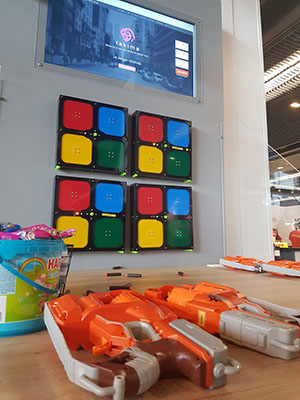
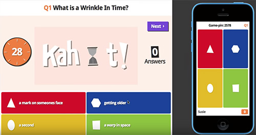

# Takahoot - Targets for Kahoot Games

## What is Kahoot?

Kahoot is this very cool tool to create quizzes and trivia for educational (or any other) purposes.  
Once the admin has setup all the questions, any player can just join the game and answer using a phone or any device that has a decent browser.

## What is Takahoot?
Well, we love Kahoot, we just thought that a phone was too "common" of a device to be fun. 
So we made a target and bought nerf guns to replace it and answer all the questions while shooting.  
Simple enough isn't it?

Although this may seem **easy**, it actually means that we:
 * Conceived and Modelized every piece in 3D
 * Used 3D printers to print some of the parts
 * Used Laser-cutting machines to create the rest of the parts
 * Found and assembled the right electronics and sensors
 * Created an Arduino software + binary serial protocol to handle target-logic
 * Developed the main software UI to launch and control the games from your computer
 
We are very proud of this project and hope it can be useful to create a more ludic way of learning.

## Getting started guide

Already have your own targets? [Get started here](https://resourcepool.github.io/takahoot).

## Maker guide
Want to create your own device from scratch? [Follow the guide](https://resourcepool.github.io/takahoot).

Don't want to bother buying and printing / cutting materials?  
[Contact-us](mailto:loic@takima.fr) and we will find a way to do that for you and send you the whole kits ready to assemble.

## Contributors

A big Thanks to [Takima](https://www.takima.fr) who sponsored us and invested much time and efforts into helping to make this project a reality.  

Thanks to [Nicolas Thierion](https://github.com/NicolasThierion) for coming up with the original idea, and to the lead contributors of the project:  
 * [Alexandre Nunesse](https://github.com/anunesse) - Kahoot API, Target fixes & Takahoot Client 
 * [Logan Lepage](https://github.com/loganlepage) - Takahoot UI & Client
 * [Loïc Ortola](https://github.com/loicortola) - Target design & making, Hardware & Arduino
