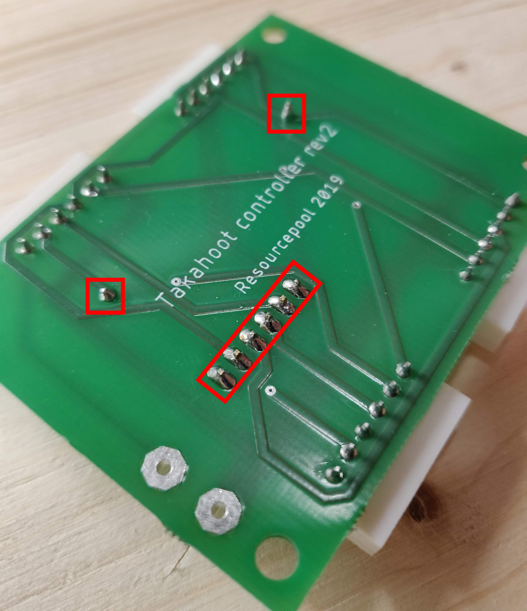
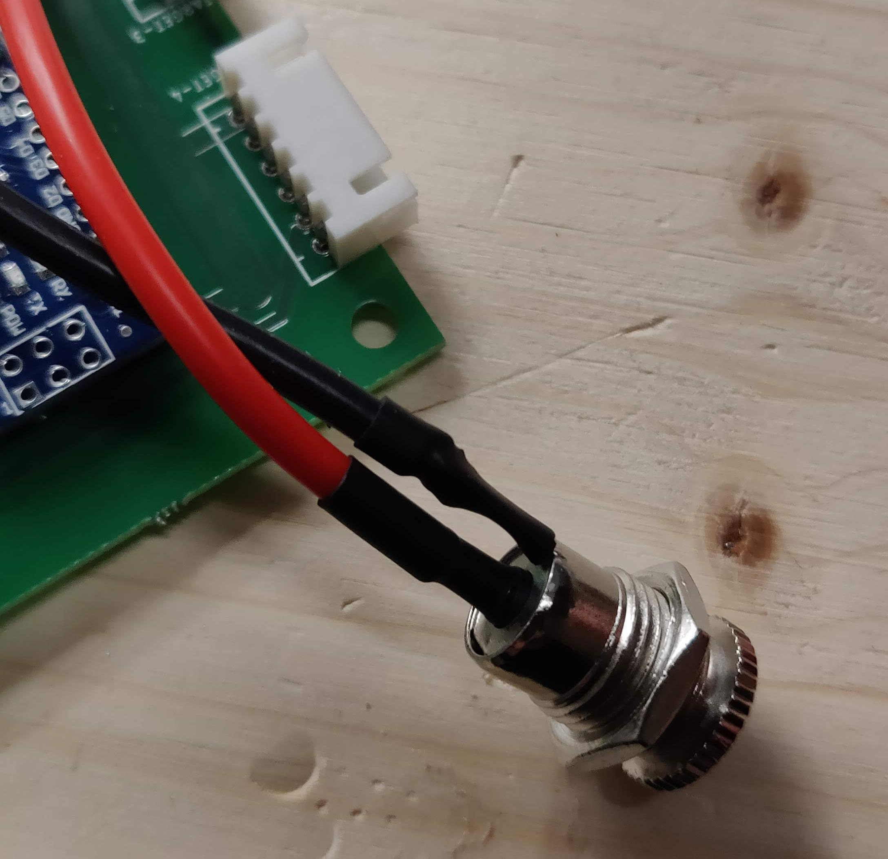
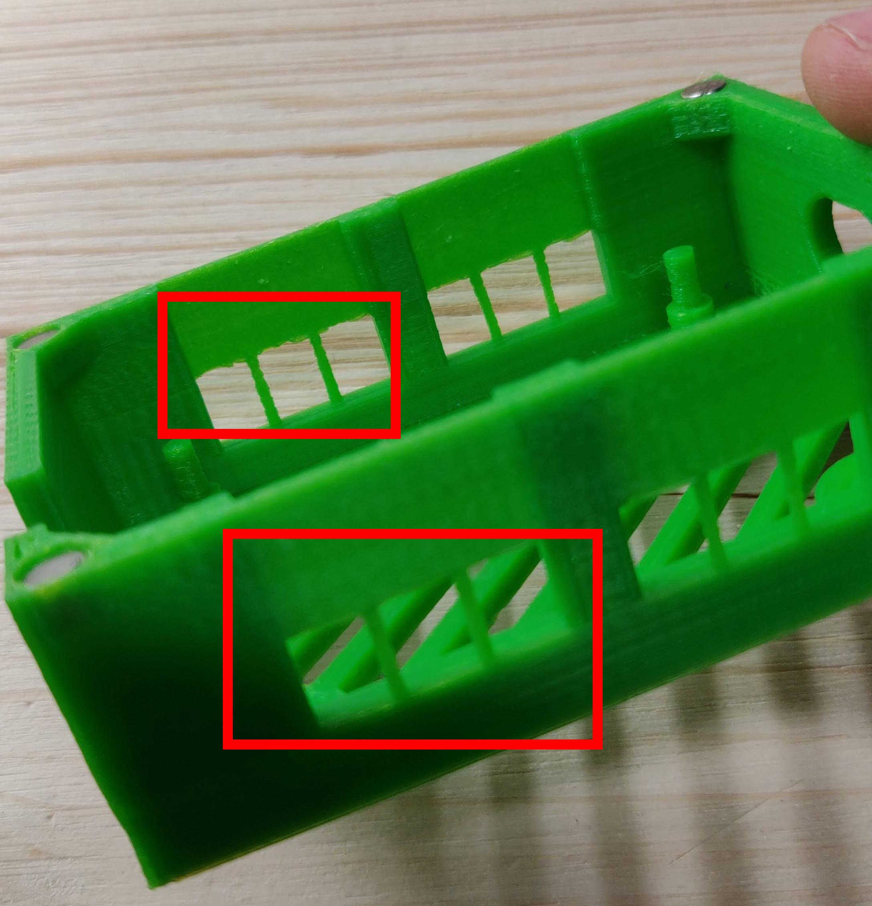
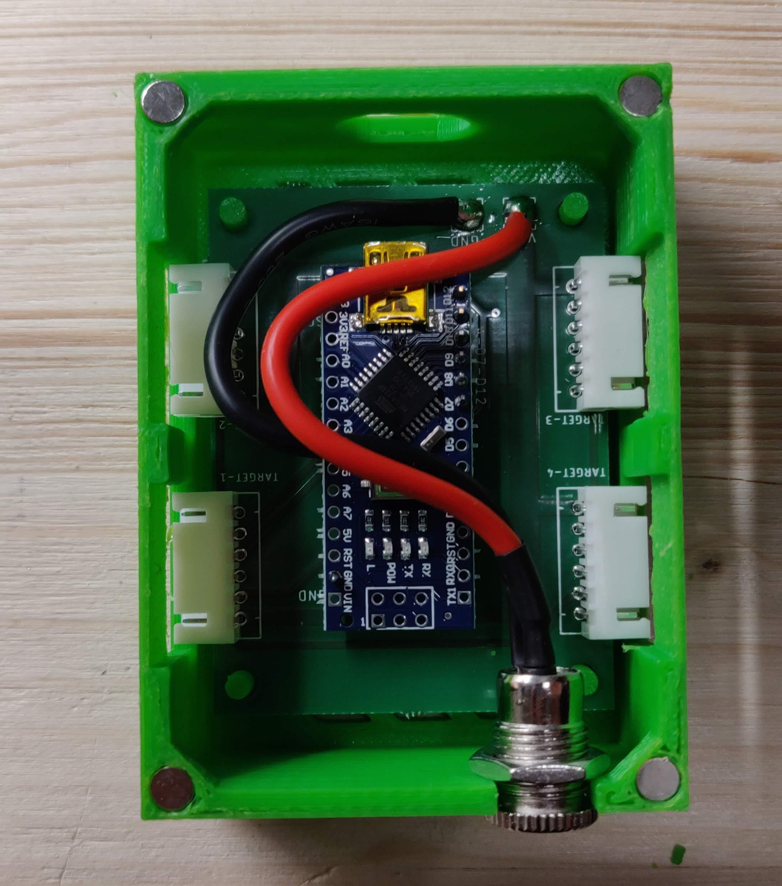

# Takahoot - Building a Target Controller

## BOM
You can find the Bill-Of-Materials in the dedicated page [here](bom.html).

## 1. Assembling the board

### JST Sockets

Take the PCB named **Takahoot controller**, grab the 6-pin JST sockets and insert them into their appropriate spots.  
Make **sure** the board is on the right side, as shown on picture!
Solder it onto the board as shown (NB: notice again which side of the board we are soldering on).

### Arduino pins & Power-Supply

Take your Arduino Nano v3 (328P recommended) and use a bolt cutter to cut out the straight-pins : 1x 6-pins, 2x 1-pin

Solder the pins on the same side of the JST Sockets.

Now be careful and insert the Arduino Nano board. Make sure the pins are in the right hole and the board in the right direction!
When you have double checked this, you can solder it carefully.
At the same time, tin-plate each power-supply cable on both ends, and solder each cable to the board. Don't hesitate to put lots of solder as this will draw a few amps of current ;).

Before you join your power-supply cables to the jack, make **sure** your jack bolt is on it. Otherwise, you may have to redo this step after feeling quite dumb (not that any of that happened to us... :D). If you use heat-shrink sleeves, now is also the moment to slip them in!

Make sure you join them nicely, it is important for each end to be isolated from the other. If you did it right, it should look like this (notice the inner-part is the +VCC. GND is on the side-pin).

Congratulations! Your board is finished!

## 2. Assembling the controller

Before you assemble the controller, you need to break the build-pins which were essential for the 3D-Print to work, but useless for us. We forgot to tell you : we put some round magnets inside both the lid and the case. The magnets should be included in the kit :) (see BOM for more info). You can glue them easily in their socket.

Once you're done, it should be like this!

Now, just insert your controller board into the case, slip the power supply at the right position, and connect your USB Cable...
Congratulations!!!

