# Takahoot - Building a Target

## BOM
You can find the Bill-Of-Materials in the dedicated page [here](bom.html).

## 1. Assembling the board

### JST Socket

Take the PCB named **Takahoot target**, grab the 6-pin JST socket and insert it into its appropriate spot.  
Make **sure** the board is on the right side, as shown on picture!

Solder it to the board as shown on picture: (NB: notice the board was flipped over! Don't forget to do the same)

### Arduino pins

Take your Arduino Nano v3 (328P recommended) and use a bolt cutter to cut out the straight-pins : 2x 3-pins, 3x 1-pin
The angled pins should already be cut-out.

Solder your angled pins first on the outside of the board (LED and PIEZO)

Then solder the other arduino pins one by one on your board.

In the end, it should look like this:

Now be careful and insert the Arduino Nano board. Make sure the pins are in the right hole and the board in the right direction!

You can now put solder on each pin and make sure your Arduino is now perfectly connected to the board

Congratulations! Your board is finished!

## 2. Assembling the target

### The Box

The target box might already be assembled. If it's the case, you can go directly to the next part: LED Strip

In this part, we will only consider the case of the target, as shown on picture.
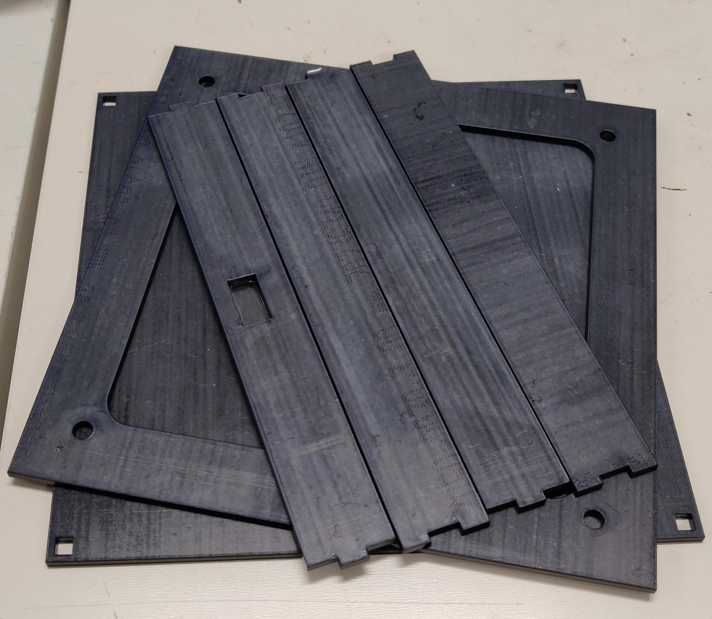

First thing to do is to glue the sides together. This should be easy if you use a dense glue. We recommend using Plexiglas glue gel, which will give you both a firm grip from the first second and a quick dry.

After, find which will be the front and which will be the back of your target (as shown below).
The center square hole (to connect the target) is not centered vertically. It is closer to the back of the target.

If you got it right, you can now glue the top of the target, using the same Plexiglas glue. Be gentle and precise.
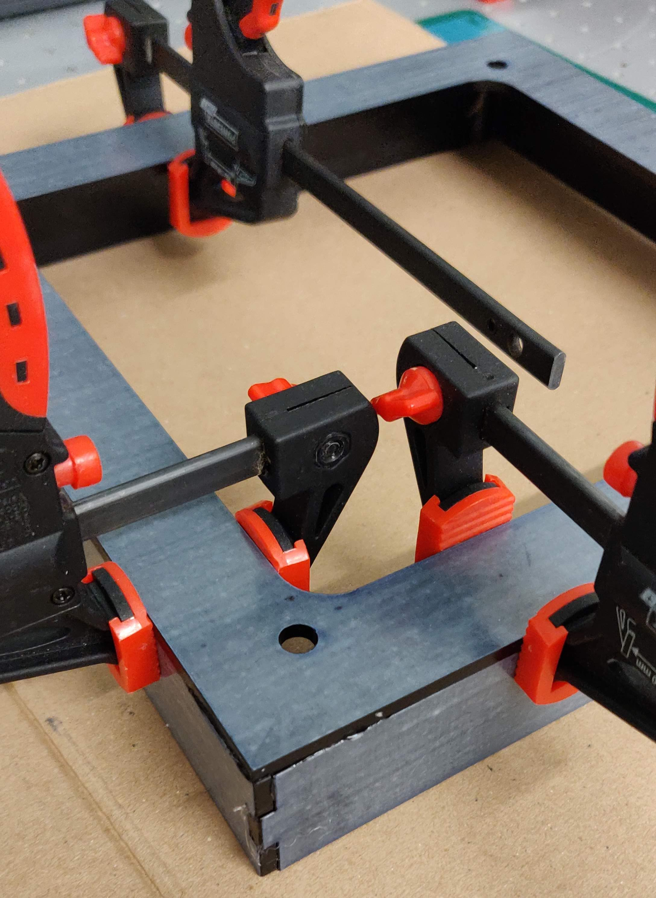

Your box is almost ready. To make sure we can access the target content (for firmware upgrades or anything else), we thought it would be nice if it was screwless. Therefore, we gave you some very cool and powerful magnets.
Glue one in each corner, making sure they are all pointing the same direction (we used a red marker to mark their direction to avoid any cruel mistakes here!). We used an Epoxy glue for that one.

Once the magnets are glued to the box, we can do the same and glue the other magnet to the back. For that one, we used plain old plastic glue, were very "generous" on the quantity, and cut anything extra after it dried.  
**Warning:** Make sure you double-check which side you are gluing the back on, and the direction of each magnet. We don't want any surprises here!

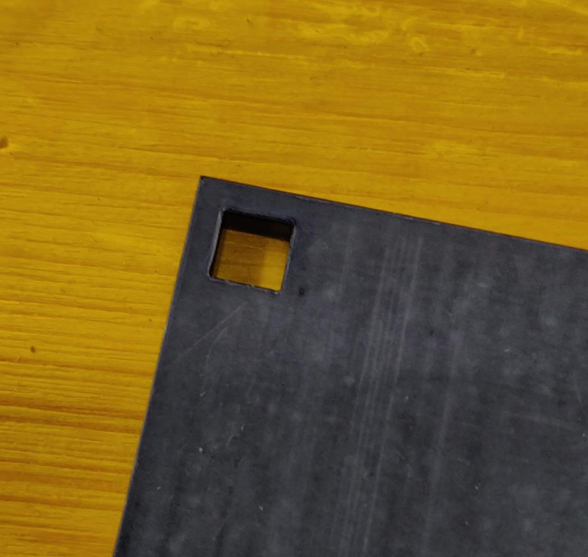

Congratulations, your box should be all set :)

### LED Strip

Take each LED Strip and plate it with tin.

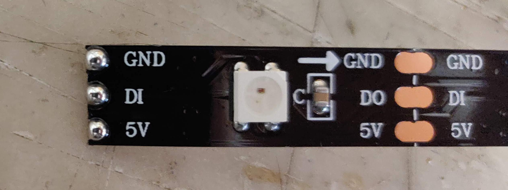

Once done, cut out 3 wire-strips of 7-7.5cm long.
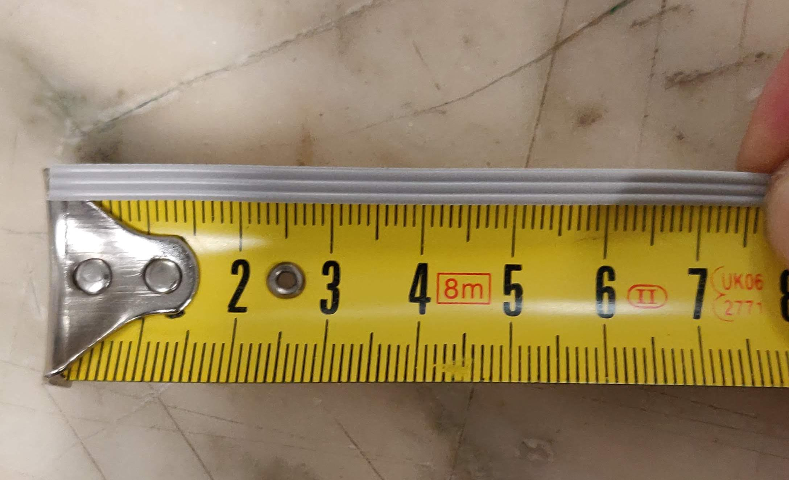

Strip the ends and plate it with tin.
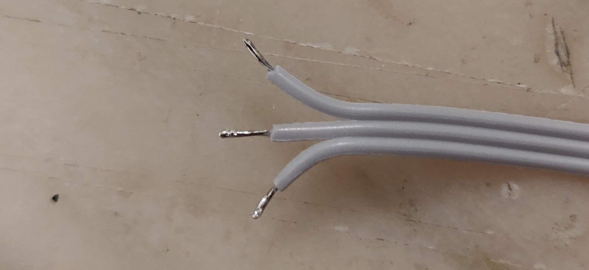

Assemble each strip to the next one, make sure that the arrow goes the same direction!
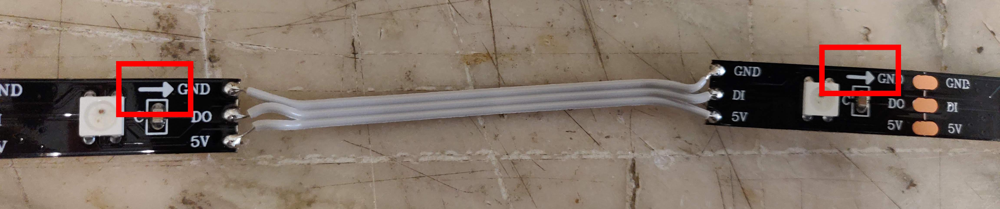

Cut one last wire-strip ~25cm long. Use your Crimping tool to make a 3-Dupont-female-pin on one end, and solder it to the first strip on the other end.

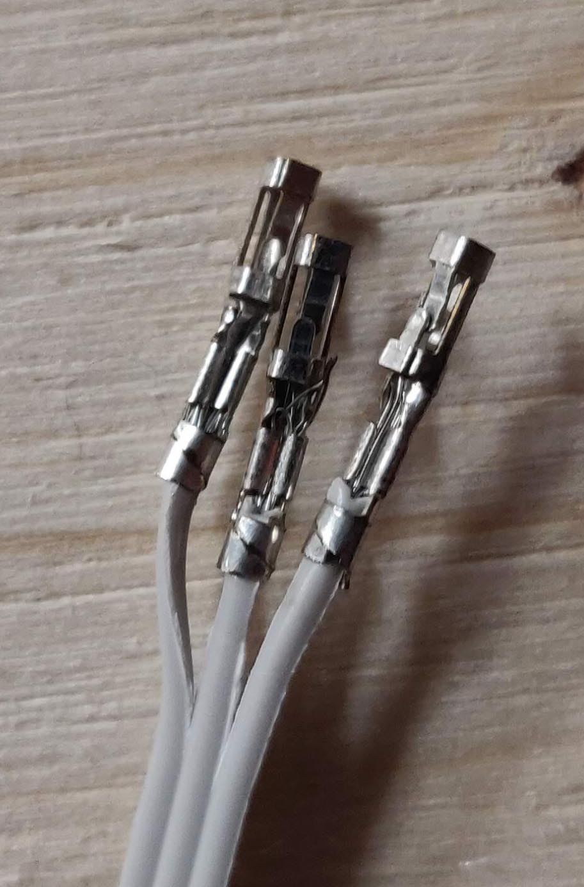

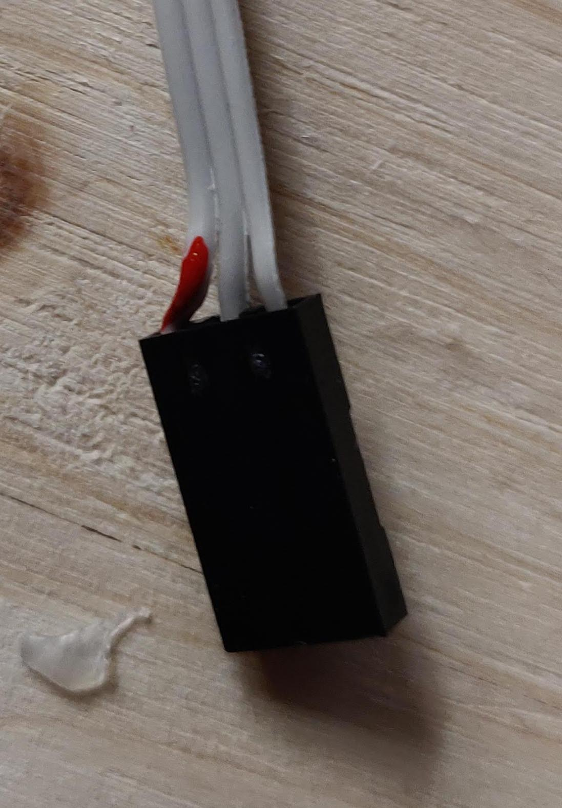

You can then fix the LEDs on the target itself.
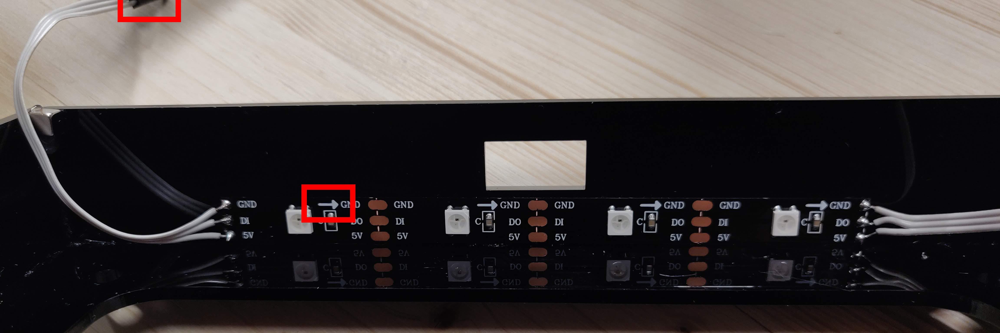

Great job!

### Parts, Sensor & PCB

Take all the bolts and insert them in the 3D-printed supports.
Sometimes, prints are so narrow that your plastic support wont let the bolt come in.
This is where your soldering-iron might come handy. Be careful, heat the bolt slowly until it is perfectly in position.

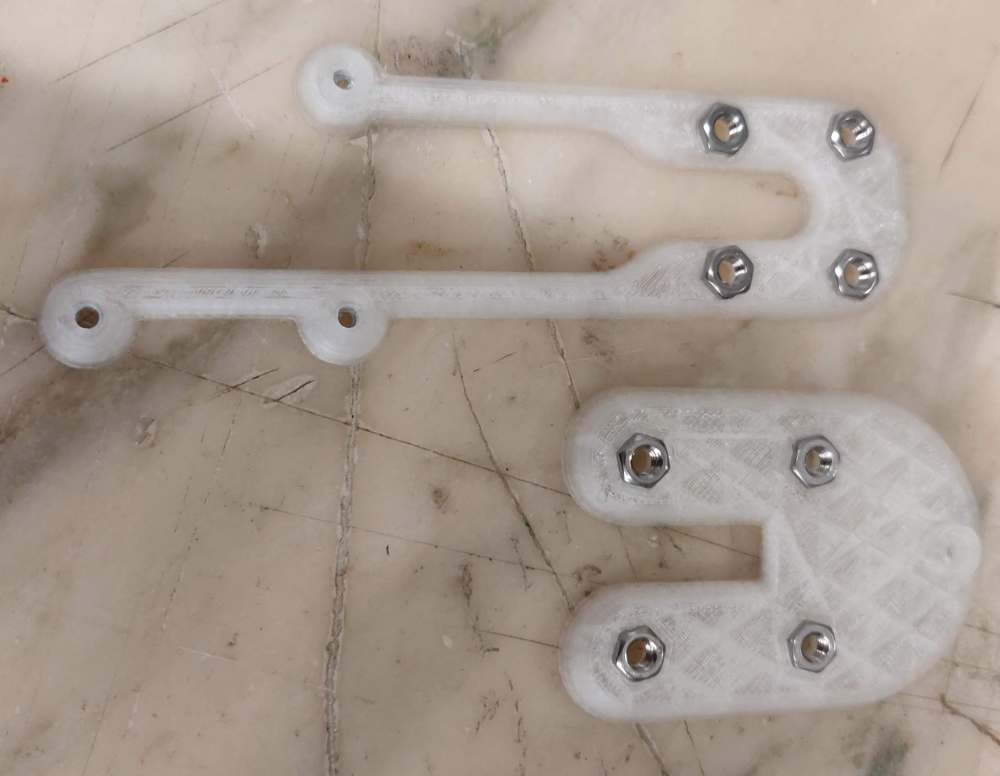

Then you can screw on the board using the M3 screws.

Take the Piezo sensor and lock both wires inside their small PCB controller.
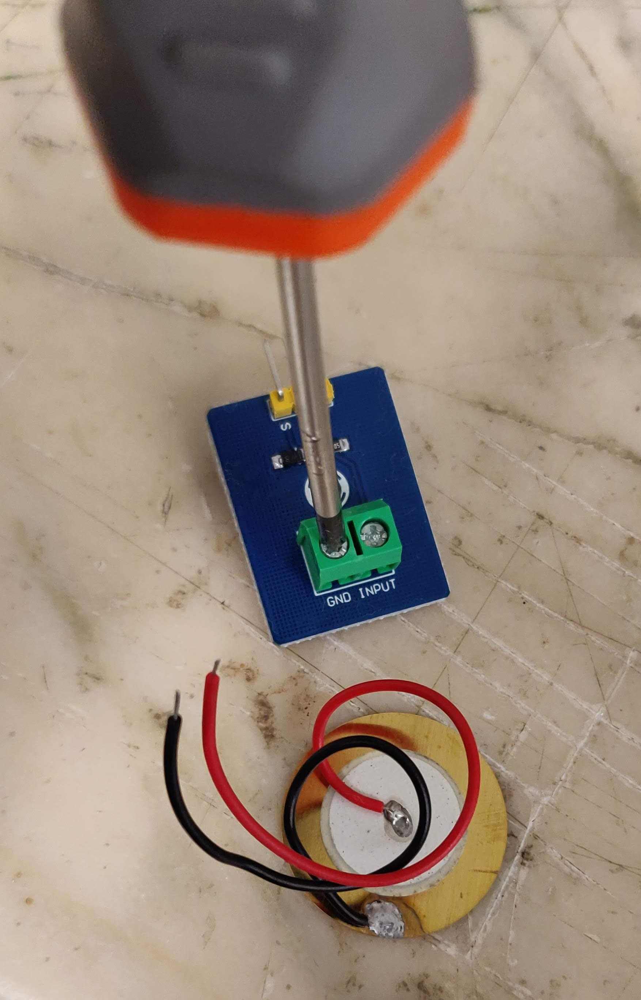

Then easily screw it on the Piezo 3D-printed support

You are now ready to fix the Piezo and its support on the white Plexiglas Hit-zone.

Get the Silicon dampers and make sure you put the Hit-zone in the right direction.
You are now ready to fix the Piezo and its support on the white Plexiglas Hit-zone.
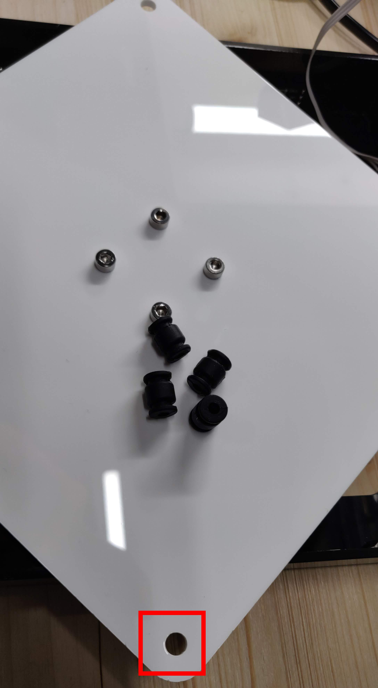

Fix them one by one like this:
You are now ready to fix the Piezo and its support on the white Plexiglas Hit-zone.
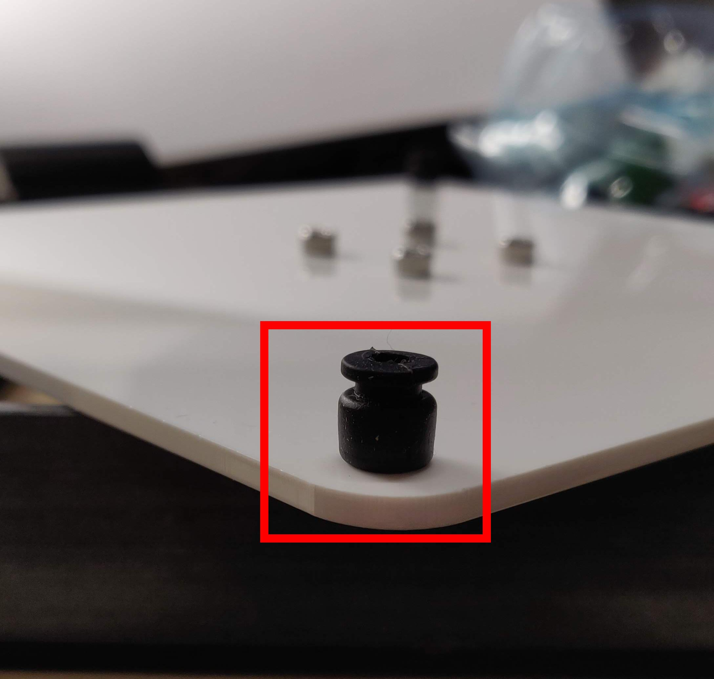

Now find a way to make each damper go through the frontend of the Target. Warning: this may start to look VERY COOL!
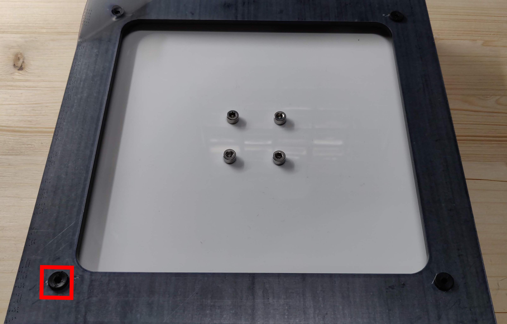

Once you're done, you can simply put the wires together (make sure to get the wires right!!!)
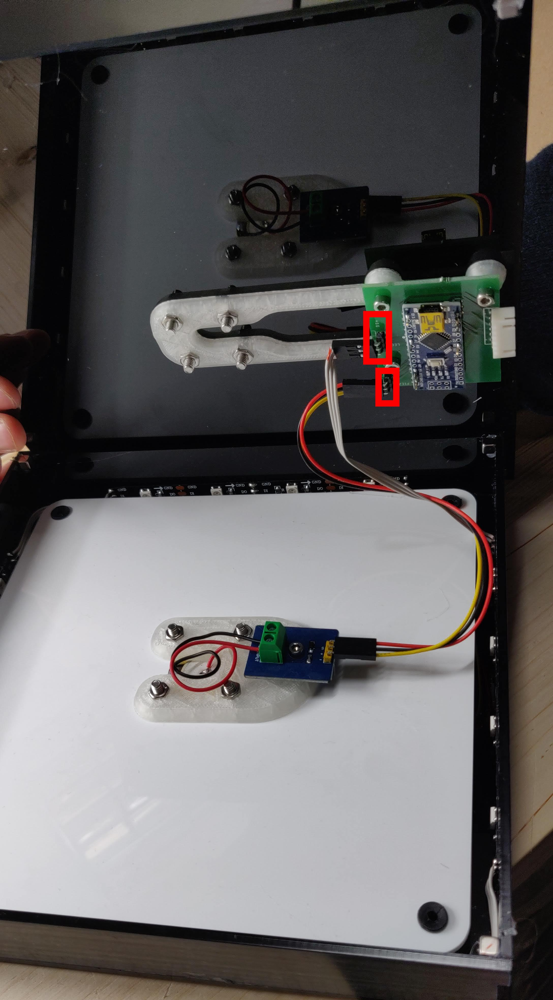

TADAAAAAAA

