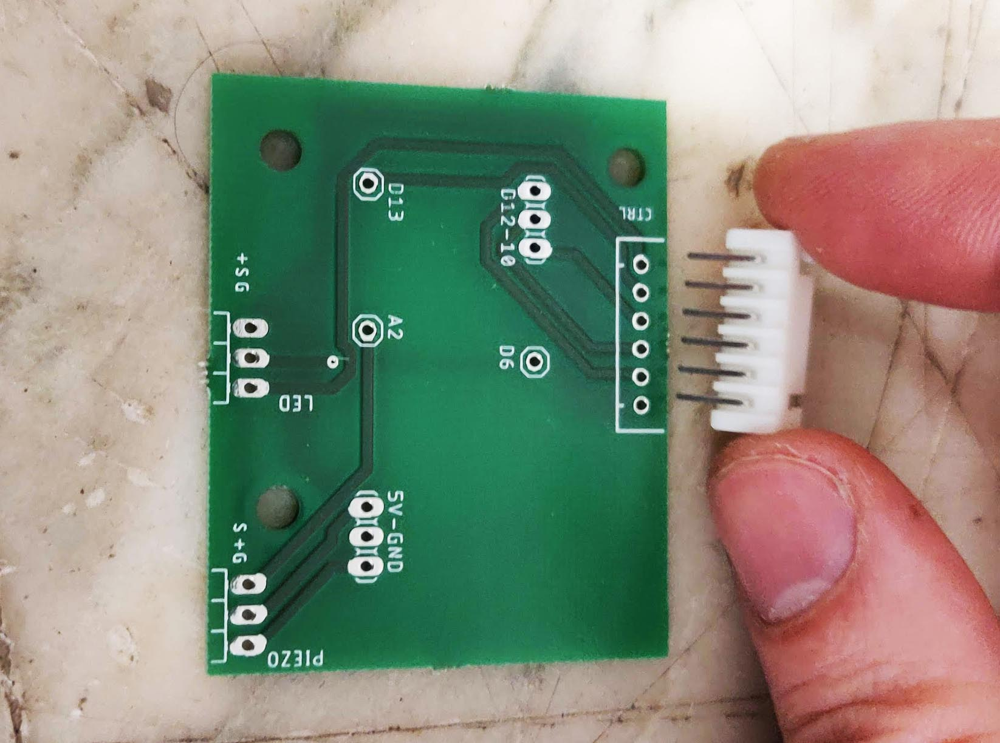
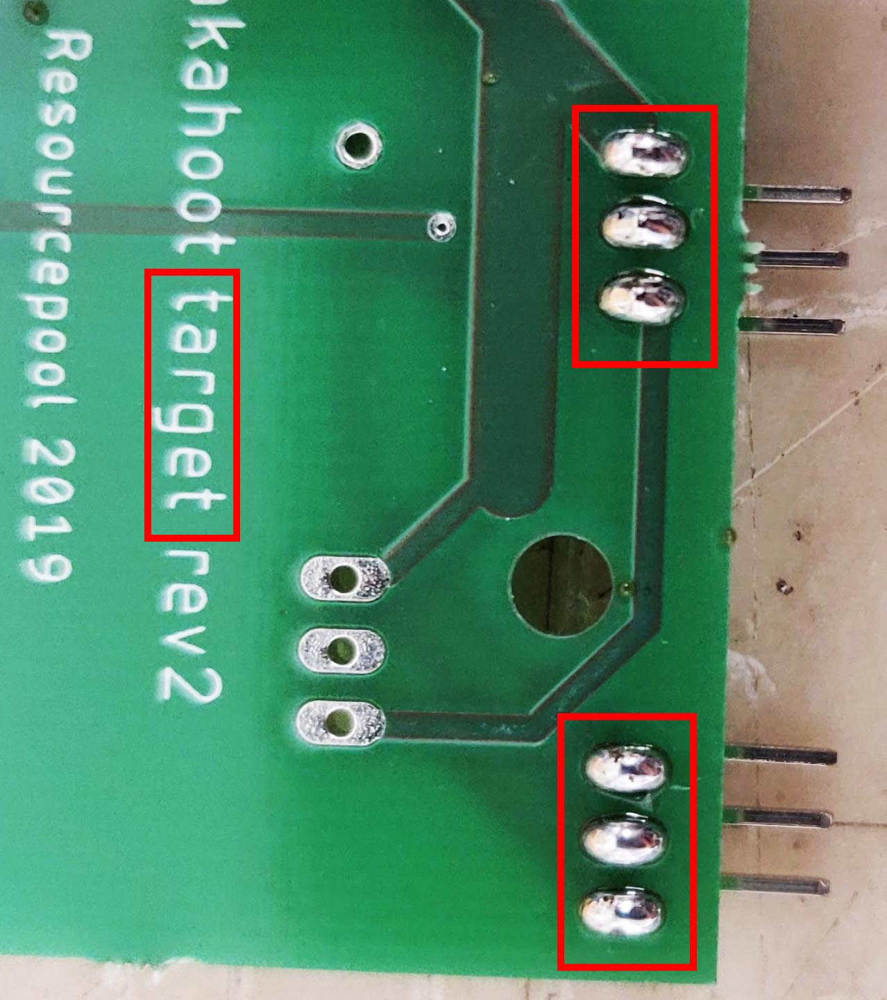
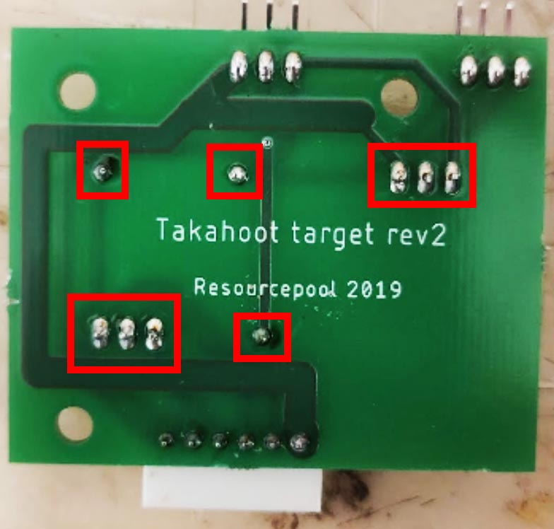

# Takahoot - Building a Target

## BOM
You can find the Bill-Of-Materials in the dedicated page [here](bom.html).

## 1. Assembling the board

### JST Socket

Take the PCB named **Takahoot target**, grab the 6-pin JST socket and insert it into its appropriate spot.  
Make **sure** the board is on the right side, as shown on picture!

Solder it to the board as shown on picture: (NB: notice the board was flipped over! Don't forget to do the same)

### Arduino pins

Take your Arduino Nano v3 (328P recommended) and use a bolt cutter to cut out the straight-pins : 2x 3-pins, 3x 1-pin
(NB: On the picture, we took an extra 3-pin just in case, but you're not supposed to need it in your kit)
The angled pins should already be cut-out.

Solder your angled pins first on the outside of the board (LED and PIEZO)

Then solder the other arduino pins one by one on your board.

In the end, it should look like this:

Now be careful and insert the Arduino Nano board. Make sure the pins are in the right hole and the board in the right direction!

You can now put solder on each pin and make sure your Arduino is now perfectly connected to the board

Congratulations! Your board is finished!
